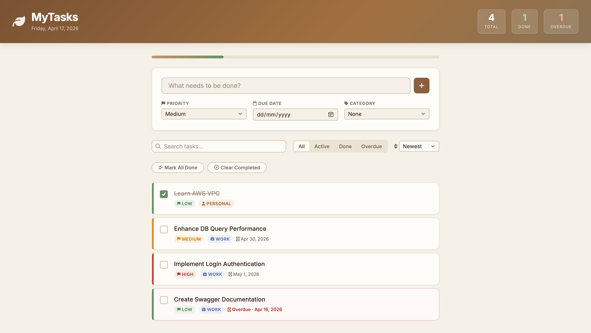
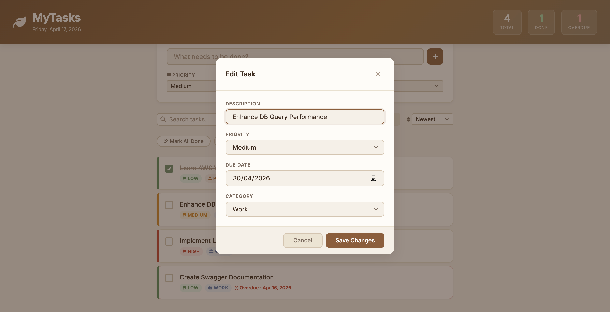
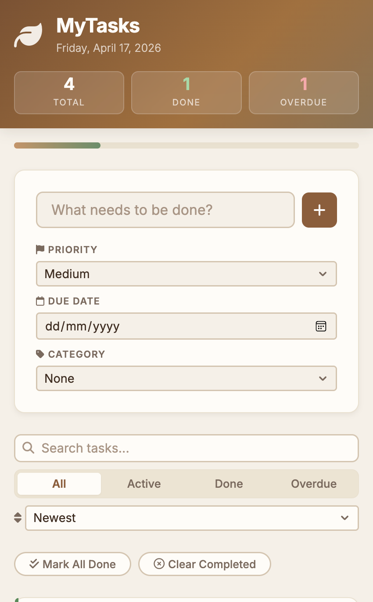
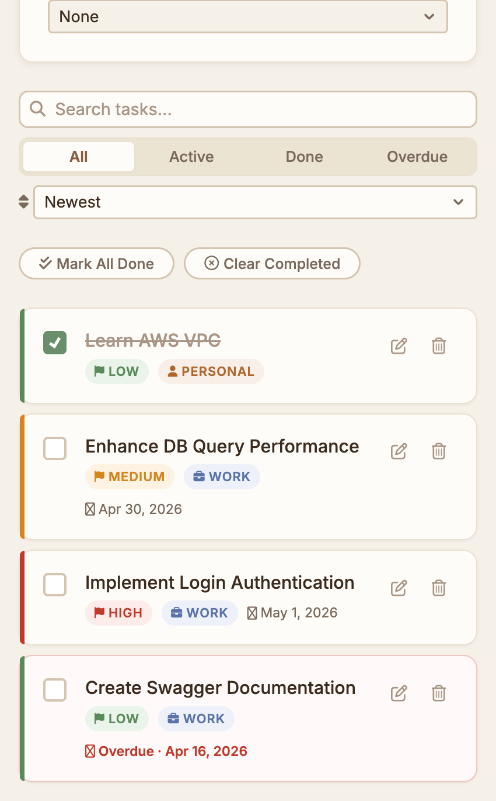
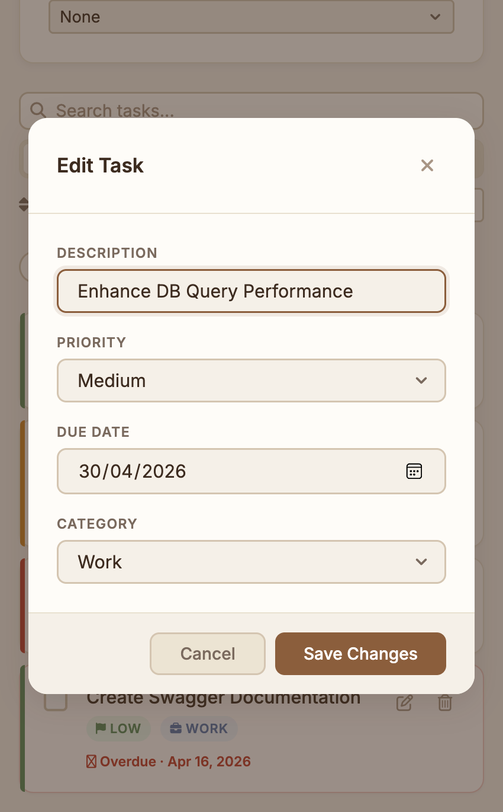

# MyTasks — To-Do Application

A lightweight, feature-rich task management application built with pure HTML, CSS, and Vanilla JavaScript.

---

## Table of Contents

- [Overview](#overview)
- [Screenshots](#screenshots)
- [Features](#features)
- [Tech Stack](#tech-stack)
- [Getting Started](#getting-started)
- [Usage](#usage)
- [Changelog](#changelog)
- [Known Issues](#known-issues)
- [License](#license)

---

## Overview

MyTasks is a client-side task management application that persists data in the browser's `localStorage`. It requires no build step, no backend, and no package manager — open `index.html` and it works.

---

## Screenshots

### Web

| Homepage | Add Task |
|---|---|
|  |  |

---

### Mobile

| Homepage | Add Task |
|---|---|
|   |  |

---

## Features

### Task Management
| Feature | Description |
|---|---|
| Add Task | Create a task with description, priority, due date, and category |
| Edit Task | Update any field of an existing task via modal |
| Delete Task | Remove a task with a confirmation prompt |
| Complete Task | Toggle completion state with an animated checkbox |
| Mark All Done | Toggle all tasks between complete and active in one click |
| Clear Completed | Bulk-remove all completed tasks with confirmation |

### Organisation & Discovery
| Feature | Description |
|---|---|
| Priority Levels | High / Medium / Low — colour-coded left border stripe and badge |
| Categories | Work, Personal, Health, Finance, Other — each with a distinct badge |
| Due Dates | Optional due date with overdue and "Today" indicators |
| Search | Keyword filter across all task descriptions |
| Filter Tabs | All / Active / Done / Overdue views |
| Sort Options | Newest, Oldest, By Priority, By Due Date |

### UI & UX
| Feature | Description |
|---|---|
| Progress Bar | Visual completion percentage updated in real time |
| Stats Header | Live Total / Done / Overdue counts pinned to the header |
| Notifications | Success and error toasts via Notyf |

---

## Tech Stack

| Layer | Technology |
|---|---|
| Markup | HTML5 (semantic elements, ARIA attributes) |
| Styling | CSS3 (custom properties, flexbox, keyframe animations) |
| Logic | Vanilla JavaScript ES6+ (`"use strict"`, IIFE modules, `Object.freeze`) |
| Icons | [Font Awesome 6.5](https://fontawesome.com/) via CDN |
| Notifications | [Notyf 3](https://github.com/caroso1222/notyf) via CDN |
| Fonts | [Inter](https://fonts.google.com/specimen/Inter) via Google Fonts |
| Storage | Browser `localStorage` |

---

## Getting Started

### Prerequisites

A modern browser with JavaScript enabled. No Node.js, npm, or build tools are required.

### Installation

```bash
# Clone the repository
git clone https://github.com/yitmeng00/my-tasks-to-do-app.git

# Enter the project directory
cd my-tasks-to-do-app

# Open directly in browser
open index.html
```

Alternatively, serve it with any static file server to avoid potential browser restrictions on local file access:

```bash
# Python 3
python3 -m http.server 8080

# Node.js (npx)
npx serve .
```

Then open [http://localhost:8080](http://localhost:8080) in your browser.

---

## Usage

### Adding a Task
1. Type a description in the input field at the top.
2. Optionally select a **Priority**, **Due Date**, and **Category**.
3. Press **Enter** or click the **+** button.

### Editing a Task
- Hover over a task row and click the **pencil** icon to open the edit modal.
- Update any field and click **Save Changes**.

### Filtering & Searching
- Use the **filter tabs** (All / Active / Done / Overdue) to narrow the list.
- Type in the **search box** to filter by keyword in real time.
- Use the **sort dropdown** to reorder by date added, priority, or due date.

### Bulk Actions
- **Mark All Done** — toggles all tasks between complete and active.
- **Clear Completed** — permanently removes all completed tasks after confirmation.

---

## Changelog

### v2.0.0
- Full UI revamp with earth-tone design system (sienna, sage, cream palette)
- Replaced dynamic modal construction with a reusable static modal overlay
- Refactored JavaScript into modular pattern: `StorageManager`, `State`, `Renderer`, `EventHandlers`, `ModalService`, `NotificationService`, `App`
- Added task priority (High / Medium / Low) with colour-coded indicators
- Added optional due dates with overdue and "Today" status labels
- Added category tagging (Work, Personal, Health, Finance, Other)
- Added live search, filter tabs (All / Active / Done / Overdue), and sort options
- Added progress bar and real-time stats (Total / Done / Overdue) in header
- Added bulk actions: Mark All Done, Clear Completed
- Added `min` date constraint on all date inputs to prevent past-date selection
- Added custom CSS chevron on all `<select>` elements (`appearance: none` + SVG background)
- Improved responsive layout for tablet (768px), mobile (375px), and small mobile (320px)
- Migrated font from Poppins to Inter
- Switched localStorage key to `mytasks_todos_v2` (fresh namespace)

### v1.0.0
- Initial release
- Add, edit, delete, and complete tasks
- localStorage persistence

---

## Known Issues

| # | Status | Description |
|---|---|---|
| 1 | Fixed | Long task labels overflowed and obscured action buttons |
| 2 | Fixed | Strikethrough style failed to apply correctly on multi-line labels |

---

## License

This project is licensed under the [MIT License](LICENSE).
